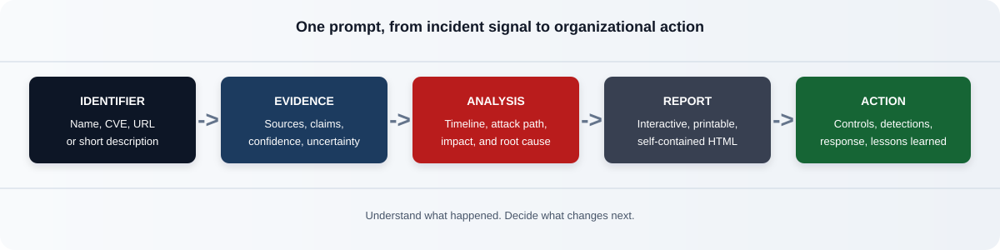

# Cybersecurity Incident Analysis

## One prompt. The whole incident. Actions your organization can use.

Cybersecurity incidents are usually documented across advisories, vendor blogs, breach
notifications, technical write-ups, and scattered news reports. Finding the facts is hard.
Knowing which facts are reliable — and what to change in your own organization — is harder.

This project turns one incident name, CVE, advisory URL, or short description into a rigorous,
evidence-graded incident analysis. Attach the prompt to an AI assistant with web-search access
and get a self-contained interactive report that brings the incident together in one place:



- what happened, when it happened, and who was affected;
- the attack path, root cause, vulnerabilities, and observable indicators;
- claims separated from evidence, with uncertainty made explicit;
- technical findings translated into controls, detections, response actions, and lessons; and
- practical takeaways that security, engineering, and leadership teams can apply to their own
  environments.

### Stop collecting tabs. Start building understanding.

The goal is not another generic incident summary. It is a reusable briefing and improvement
tool: a single report that helps a team understand the incident, challenge unsupported claims,
prioritize defensive work, and turn public lessons into organization-specific actions.

## Use the prompt

Attach [prompt/cybersecurity-incident-analysis-prompt.md](prompt/cybersecurity-incident-analysis-prompt.md)
to an AI assistant with research or web-search access, then provide just one incident name,
CVE, advisory URL, or short description. No research plan, module selection, or second prompt
is required. The assistant scopes the incident, researches the evidence, grades confidence,
performs the analysis, and produces the report.

The prompt governs:

- incident scoping and source collection;
- evidence quality, confidence, and uncertainty;
- timeline, attack-path, impact, and root-cause analysis;
- incident-specific findings and organization-ready recommendations;
- a consistent report structure and visual publication shell;
- interactive graphs, accessibility, offline behavior, and printing; and
- AI-generated disclosures and third-party notices.

The result is designed to be useful to both investigators who need defensible facts and
defenders who need a clear answer to: **“What should we do differently now?”**

### Start in your preferred AI assistant

| ChatGPT | Claude |
| --- | --- |
| [Open ChatGPT](https://chatgpt.com/) and attach the [analysis prompt](prompt/cybersecurity-incident-analysis-prompt.md). | [Open Claude](https://claude.ai/new) and attach the [analysis prompt](prompt/cybersecurity-incident-analysis-prompt.md). |

For repeat ChatGPT use, create a Custom GPT once using the
[ChatGPT Custom GPT setup](chatgpt_custom_gpt/README.md). Upload the analysis prompt as the
GPT's Knowledge file, then start future chats with only the incident identifier.

For repeat Claude use, upload the packaged
[Claude skill](claude_skill/incident-analysis.skill) to Claude's Skills/Capabilities area
where available. The skill contains the incident-analysis workflow, reference material,
HTML scaffold, validation helper, and Archify-backed graph instructions.

[](prompt/cybersecurity-incident-analysis-prompt.md)
[](https://en3ra.github.io/cyber-incident-analysis/examples/xz-utils-cve-2024-3094.html)

> GitHub sanitizes README links and does not allow repositories to force external links into
> a new tab. Use Cmd/Ctrl-click or your browser's “open link in new tab” command for ChatGPT,
> Claude, and the prompt links. The example report opens as a live GitHub Pages preview.

**Evidence-graded** &nbsp; **Action-oriented** &nbsp; **Incident-adaptive** &nbsp; **Self-contained HTML** &nbsp; **Offline-ready**

> **Important:** AI-generated reports are decision-support, not a substitute for incident
> response expertise. Review the cited primary sources, validate findings against your
> environment, and obtain appropriate technical and legal review before acting.

## Repository Structure

```text
prompt/       Latest reusable incident-analysis prompt
chatgpt_custom_gpt/ Reusable ChatGPT Custom GPT setup
claude_skill/ Packaged Claude skill for reusable incident analysis
src/graph/    React Flow reference graph source and styles
scripts/      Deterministic bundle embedding and validation
docs/         Workflow graphic and Archify repository architecture diagram
examples/     Validated self-contained XZ incident report
.github/      CI validation workflow
```

See [RELEASE_NOTES.md](RELEASE_NOTES.md) for current unreleased changes.

The [live XZ reference report](https://en3ra.github.io/cyber-incident-analysis/examples/xz-utils-cve-2024-3094.html)
opens as an interactive GitHub Pages preview. The source
[HTML file](examples/xz-utils-cve-2024-3094.html) is also available in the repository and
contains its graph runtime, styles, incident data, PNG export support, and open-source notices
inline.

The repository architecture is also available as an Archify diagram:
[source JSON](docs/evidence-graded-incident-analysis.architecture.json) and
[self-contained HTML](docs/evidence-graded-incident-analysis.architecture.html).

## Development

Requires Node.js 20 or newer.

```sh
npm ci
npm run build
npm run validate
```

`npm run build` bundles the graph source and embeds it between the preserved bundle markers
in the reference HTML. Generated `.graph-build/` files and `node_modules/` are intentionally
excluded from version control.

## Validation

The validator checks:

- retired variant wording is absent from the prompt;
- the eight fixed Part 0-VII dividers are present;
- both AI-generated/not-official notices remain;
- the HTML has no external runtime resources;
- bundle markers remain reproducible; and
- every package actually included by esbuild has matching versioned notices in both
  [THIRD_PARTY_NOTICES.txt](THIRD_PARTY_NOTICES.txt) and the distributable HTML.

The number and titles of sections inside each Part may vary by incident. That flexibility is
intentional: the shell is fixed, while the analysis adapts to the available evidence and the
incident's unique technical and organizational lessons.

## Contributing

Security professionals can help improve this project by proposing prompt refinements, adding
incident examples, testing reports against primary sources, or sharing practical defensive
takeaways. Read [CONTRIBUTING.md](CONTRIBUTING.md) before opening a pull request.

When sharing the project, link to the repository and invite practitioners to test it with an
incident they know well. Real-world review from incident responders, threat researchers,
defenders, and security engineers is especially valuable.

## Licensing

The original source code, prompt, documentation, graphics, and report framework in this
repository are licensed under the [MIT License](LICENSE), except for the example reports and
third-party materials identified below. This license does not grant rights to third-party
incident content, trademarks, or branding.

The example reports in `examples/` are excluded from this project license. They contain
incident-source material, trademarks, and bundled software that may be subject to separate
rights and notices. Bundled dependencies use permissive MIT, ISC, or BSD-3-Clause licenses;
their notices and respective copyright holders are listed in
[THIRD_PARTY_NOTICES.txt](THIRD_PARTY_NOTICES.txt).

### Third-party attribution

The interactive graph is built with and gives credit to:

- [xyflow](https://github.com/xyflow/xyflow) for React Flow;
- [Meta](https://github.com/facebook/react) for React and React DOM;
- [Paul Henschel](https://github.com/pmndrs/zustand) and contributors for Zustand;
- [W.Y.](https://github.com/bubkoo/html-to-image) for html-to-image;
- [Jorge Bucaran](https://github.com/jorgebucaran/classcat) for classcat;
- [Mike Bostock](https://github.com/d3) and contributors for D3 components; and
- [Evan Wallace](https://github.com/evanw/esbuild) for esbuild.

See [THIRD_PARTY_NOTICES.txt](THIRD_PARTY_NOTICES.txt) for the complete notices, versions,
copyright statements, and license terms.